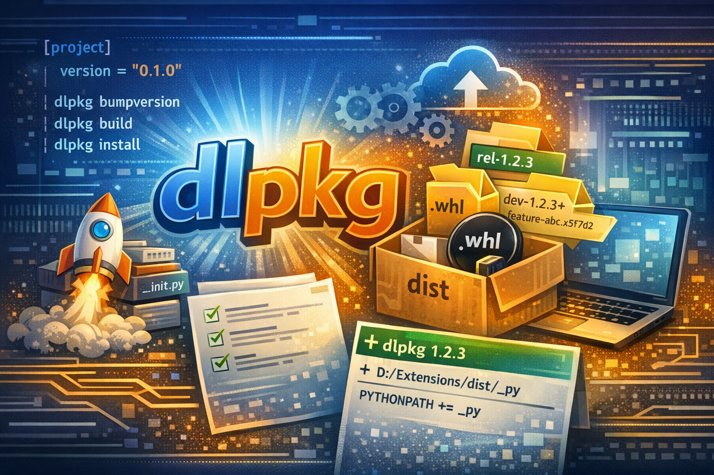

# dlpkg

🐍 Python version: **3.13**

`dlpkg` is a command line tool to help with Python package development, versioning, building, and publishing.

## Install dlpkg

Install dlpkg locally for development for your active Python environment.
Make sure you activate the Python environment you want to use before installing dlpkg.
```commandline
py -m pip install path/to/dlpkg_root
```

## Usage

1. Navigate to your package root (`cd path/to/your/package`).
2. Use the `dlpkg [subcommand] [options] path` command to manage your package.


### Stages of package management

Stages of package management with dlpkg: \
`Development🧪️️ --> Versioning🔢 --> Building🛠️ --> Publishing📦📌`

**Development:** Edit your source code in the `src/your_package/` folder (or as specified in your pyproject.toml).  \
**Versioning:** Use `dlpkg version --bump [part]` to increase the version. \
**Building:** Use `dlpkg build` to build the package distribution (wheel) file.    \
**Publishing:** Use `dlpkg publish --out-dir [path]` to publish the package to a target directory with versioned folder names.

> [!NOTE]  
> `dlpkg publish` without position argument is automatically building the package before publishing.

## Requirements

The tool expects a standard Python package structure:
```
your_package/
├── src/your_package/   (Source code for your package: "src" or "python" are common)
│   └── __init__.py     (Optional: __version__ can be defined here, but it's not required)
└── pyproject.toml      (Must contain the version in the [project] section, and the package-dir in [tool.setuptools])
```
pyproject.toml example:
```toml
[project]
name = "your_package"
version = "0.1.0"

[tool.setuptools]
# This tells setuptools to look for packages in the "src" directory.
# Adjust if your source code is in a different folder (e.g.: "/python").
package-dir = {"" = "src"}
```

## Sub-commands

For convenience, navigate to your package root before running the commands.
You can also provide positional argument `root_dir` to point to the root of your package root. \
`dlpkg [subcommand] [options] path/to/your/package`


### Version

`dlpkg version [options] [root_dir]`

Print the current version of the package type `dlpkg version` without any arguments or flags.
Bump the version of the package `dlpkg version --bump <part>`. By default `patch` version is bumped
if no part is specified. Available parts to bump: `patch`, `minor`, `major`, `prerelease`.
It expects the following format: `<major>.<minor>.<patch>[-<dev-tag>]`. Example: `0.1.0`, `1.2.3-dev14+feature.a1b2c3d`

**Arguments & Flags:**
- root_dir : Optional argument, specify the root of your package (default is current directory).
- --bump : Optional flag, specify which part of the version to bump: patch, minor, major, prerelease. (default: patch)

```commandline
dlpkg version /path/to/your_package
cd /path/to/your_package
dlpkg version --bump minor
```

> [!TIP]
> Read more about semantic versioning here: https://semver.org/

### Build

`dlpkg build [options] [root_dir]`

Build `wheel` distribution for your package. It uses pyproject.toml configuration
to determine the source directory and version. The built distributions are saved
in the `./build` folder by default, but you can specify a different output directory
with the `--out-dir` flag.

**Arguments & Flags:**
- root_dir : Optional argument, specify the root of your package (default is current directory).
- --out-dir : Optional flag, specify the output directory for the built distributions (default: `./build`).

```commandline
dlpkg build --out-dir /path/to/build /path/to/your_package
cd /path/to/your_package
dlpkg build --out-dir /path/to/build
dlpkg build
```

### Publish

`dlpkg publish [options] [source_path]`

Publish the package to a target directory with versioned folder names.
This creates: `/target_folder/yourpkg/rel-x.y.z/`

**Arguments & Flags:**
- source_path : Optional argument, specify the root of your package or wheel file (default is current directory).
- --out-dir : Optional flag, Specify the target directory where the package should be published. (default: `./publish`)
- --channel : Optional flag, specify the release channel (default: rel, available: `rel`, `dev`).
- --version : Optional flag, override version (default: read from pyproject).
- --write-mod : Optional flag, write a mod file with the published version and channel information (default: False).
- --read-only : Optional flag, make the published package read-only by removing write permissions (default: False).
- --dry-run : Optional flag, print the publish steps without actually performing them (default: False).

```commandline
dlpkg publish --out-dir X:/publishes /path/to/your_package
dlpkg publish --out-dir X:/publishes path/to/*.whl
cd /path/to/your_package
dlpkg publish --out-dir X:/publishes --read-only
dlpkg publish --out-dir X:/publishes --channel dev
dlpkg publish --out-dir X:/publishes --dry-run
```

### List

`dlpkg list [options] package_name`

List published versions of a package previously published with `dlpkg publish --out-dir`.
Shows up to the latest 10 `rel-*` (published) and `dev-*` (development) versions found
under `<folder>/<package_name>/`, sorted newest-first using semantic version ordering.

The folder to scan is resolved in this order: `--dir` flag, then the `DLPKG_PUBLISH_DIR`
environment variable, then the `install_dir` default saved via `--set-default-dir`.

**Arguments & Flags:**
- package_name : Required (unless `--set-default-dir` is given), name of the package to list versions for.
- --dir : Optional flag, folder to scan for published packages (same folder passed to `publish --out-dir`).
- --set-default-dir : Optional flag, saves PATH as the default folder to scan (written to `config.toml`) and exits.

```commandline
dlpkg list my_package --dir X:/publishes
dlpkg list --set-default-dir X:/publishes
dlpkg list my_package
```

## Contributing
Home page: https://github.com/dLantee/dlpkg \
Report issues here: https://github.com/dLantee/dlpkg/issues


## FAQ

- What if my package doesn't follow the expected structure?
  - You can customize the source directory and version retrieval
    by using the `--source-dir` flag and ensuring your `pyproject.toml`
    is properly configured.
- Presets for build, distribution, and install folders?
  - Edit `config.toml` (repo root). Set the `build_dir`/`install_dir` defaults according to your needs.

