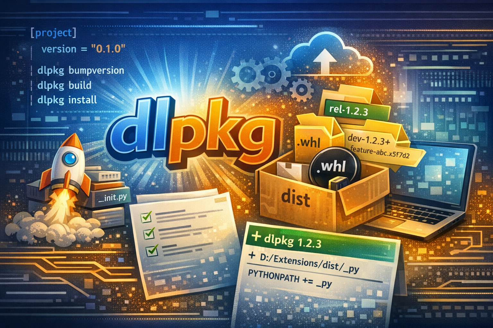

# dlpkg

🐍 Python version: **3.13**

`dlpkg` is a command line tool to help with Python package development: versioning, building,
publishing versioned copies, and pointing Maya at the copy you want to load.

## Install dlpkg

Install dlpkg locally for development for your active Python environment.
Make sure you activate the Python environment you want to use before installing dlpkg.
```commandline
py -m pip install path/to/dlpkg_root
```

## Usage

1. Navigate to your package root (`cd path/to/your/package`).
2. Use the `dlpkg [subcommand] [options] path` command to manage your package.


### Stages of package management

Stages of package management with dlpkg: \
`Development🧪️️ --> Versioning🔢 --> Building🛠️ --> Publishing📦📌 --> Using🎯`

**Development:** Edit your source code in the `src/your_package/` folder (or as specified in your pyproject.toml).  \
**Versioning:** Use `dlpkg version --bump [part]` to increase the version, or `dlpkg release --bump [part]` to bump, update the changelog, commit and tag in one go. \
**Building:** Use `dlpkg build` to build the package distribution (wheel) file.    \
**Publishing:** Use `dlpkg publish` to copy the package into a target directory with versioned folder names. \
**Using:** Use `dlpkg publish --write-mod` or `dlpkg use` to point Maya at one published version.

> [!NOTE]
> `dlpkg publish` installs straight from the package root with `pip`, so a separate `dlpkg build`
> is only needed when you want the wheel itself.

## Requirements

The tool expects a standard Python package structure:
```
your_package/
├── src/your_package/   (Source code for your package: "src" or "python" are common)
│   └── __init__.py     (Optional: __version__ can be defined here, but it's not required)
├── CHANGELOG.md        (Optional: only `dlpkg release` needs it)
└── pyproject.toml      (Must contain the version in the [project] section, and the package-dir in [tool.setuptools])
```
pyproject.toml example:
```toml
[project]
name = "your_package"
version = "0.1.0"

[tool.setuptools]
# This tells setuptools to look for packages in the "src" directory.
# Adjust if your source code is in a different folder (e.g.: "/python").
package-dir = {"" = "src"}
```

## Sub-commands

For convenience, navigate to your package root before running the commands.
You can also provide positional argument `root_dir` to point to the root of your package root. \
`dlpkg [subcommand] [options] path/to/your/package`


### Version

`dlpkg version [options] [root_dir]`

Print the current version of the package type `dlpkg version` without any arguments or flags.
Bump the version of the package `dlpkg version --bump <part>`. By default `patch` version is bumped
if no part is specified. Available parts to bump: `patch`, `minor`, `major`, `prerelease`.
It expects the following format: `<major>.<minor>.<patch>[-<dev-tag>]`. Example: `0.1.0`, `1.2.3-dev14+feature.a1b2c3d`

**Arguments & Flags:**
- root_dir : Optional argument, specify the root of your package (default is current directory).
- --bump : Optional flag, specify which part of the version to bump: patch, minor, major, prerelease. (default: patch)

```commandline
dlpkg version /path/to/your_package
cd /path/to/your_package
dlpkg version --bump minor
```

> [!TIP]
> Read more about semantic versioning here: https://semver.org/

### Release

`dlpkg release --bump <part> [options] [root_dir]`

Ship a version in one command: bump the version, move the entries under `## [Unreleased]` in
`CHANGELOG.md` into a new `## [x.y.z] - <today>` heading (adding the compare link when the file
has them), commit `Release vx.y.z` and create the annotated tag `vx.y.z`. Nothing is pushed.

The command refuses to run when the working tree has uncommitted changes, or when the
Unreleased section is empty: write the changelog entries first.

**Arguments & Flags:**
- root_dir : Optional argument, specify the root of your package (default is current directory).
- --bump : Required flag, which part to bump: `major`, `minor` or `patch`.
- --dry-run : Optional flag, print the release plan without changing anything.

```commandline
dlpkg release --bump minor --dry-run
dlpkg release --bump minor
git push && git push --tags
```

### Build

`dlpkg build [options] [root_dir]`

Build `wheel` distribution for your package. It uses pyproject.toml configuration
to determine the source directory and version. The built distributions are saved
in the `./build` folder by default, but you can specify a different output directory
with the `--out-dir` flag or the `build_dir` config setting.

**Arguments & Flags:**
- root_dir : Optional argument, specify the root of your package (default is current directory).
- --out-dir : Optional flag, output directory for the built distributions (default: `build_dir` setting, else `./build`).

```commandline
dlpkg build --out-dir /path/to/build /path/to/your_package
cd /path/to/your_package
dlpkg build --out-dir /path/to/build
dlpkg build
```

### Publish

`dlpkg publish [options] [source_path]`

Publish the package to a target directory with versioned folder names.
This creates: `/target_folder/yourpkg/rel-x.y.z/`, with a `dlpkg.toml` inside recording the
package name, channel, version, publish time and git commit.

Publishing to the `dev` channel from a git checkout appends the short commit hash as build
metadata, so the folder becomes `dev-x.y.z+abc1234` and two dev publishes never collide.

The target folder is resolved in this order: `--out-dir` flag, then the `DLPKG_PUBLISH_DIR`
environment variable, then the `publish_dir` setting, then `./publish`.

**Arguments & Flags:**
- source_path : Optional argument, specify the root of your package or wheel file (default is current directory).
- --out-dir : Optional flag, target directory where the package should be published.
- --channel : Optional flag, specify the release channel (default: rel, available: `rel`, `dev`).
- --write-mod : Optional flag, write a Maya `<name>.mod` pointing at the published folder (see [Use](#use)).
- --read-only : Optional flag, make the published package read-only by removing write permissions (default: False).
- --dry-run : Optional flag, print the publish steps without actually performing them (default: False).

```commandline
dlpkg publish --out-dir X:/publishes /path/to/your_package
dlpkg publish --out-dir X:/publishes path/to/*.whl
cd /path/to/your_package
dlpkg publish --out-dir X:/publishes --read-only
dlpkg publish --out-dir X:/publishes --channel dev
dlpkg publish --write-mod
dlpkg publish --out-dir X:/publishes --dry-run
```

### Use

`dlpkg use [options] package_name <channel>-<version>`

Point Maya at an already published version by rewriting `<name>.mod`. Switch between a dev
build and the last release, or roll back, without publishing again. The `.mod` file contains
`+ <name> <version> <folder>` and `PYTHONPATH +:= .`, so the published folder itself is importable.

The `.mod` file is written into the `mod_dir` setting when set, otherwise into the first existing
folder on `MAYA_MODULE_PATH`. The published folder is looked up the same way as for `dlpkg list`.

**Arguments & Flags:**
- package_name : Required, name of the published package.
- version : Required, the published folder to use, e.g. `rel-1.2.0` or `dev-1.3.0+abc1234`.
- --dir : Optional flag, folder holding the published packages.

```commandline
dlpkg use my_package rel-1.2.0
dlpkg use my_package dev-1.3.0+abc1234 --dir X:/publishes
dlpkg config set mod_dir D:/maya/modules
```

### List

`dlpkg list [options] package_name`

List published versions of a package previously published with `dlpkg publish`.
Shows up to the latest 10 `rel-*` (published) and `dev-*` (development) versions found
under `<folder>/<package_name>/`, sorted newest-first using semantic version ordering, with
each version's publish time. The version the Maya `.mod` file points at is marked `(active)`.

The folder to scan is resolved in this order: `--dir` flag, then the `DLPKG_PUBLISH_DIR`
environment variable, then the `publish_dir` setting saved via `dlpkg config set publish_dir`.
The number of versions shown is resolved the same way: `--limit` flag, then the `list_limit`
setting, then the default of 10.

**Arguments & Flags:**
- package_name : Required, name of the package to list versions for.
- --dir : Optional flag, folder to scan for published packages (same folder passed to `publish --out-dir`).
- --limit : Optional flag, max number of rel/dev versions to show (default: 10, or the configured `list_limit`).

```commandline
dlpkg list my_package --dir X:/publishes
dlpkg list my_package --limit 5
dlpkg config set publish_dir X:/publishes
dlpkg list my_package
```

### Prune

`dlpkg prune [options] package_name`

Delete old published versions of one channel, keeping the newest ones. The version the Maya
`.mod` file points at is never deleted. Dev builds pile up quickly, so the default channel is `dev`.

**Arguments & Flags:**
- package_name : Required, name of the published package.
- --channel : Optional flag, channel to prune (default: `dev`).
- --keep : Optional flag, how many of the newest versions to keep (default: 3).
- --dir : Optional flag, folder holding the published packages.
- --dry-run : Optional flag, print what would be deleted without deleting.

```commandline
dlpkg prune my_package --dry-run
dlpkg prune my_package --keep 5
dlpkg prune my_package --channel rel --keep 10
```

### Config

`dlpkg config <get|set|list> [key] [value]`

Get, set, or list `dlpkg`'s own settings, stored in `config.toml` (repo root). This is a
git-config-style interface to the same settings you could otherwise edit in `config.toml`
directly, useful for scripting or when you don't want to hand-edit the TOML file.

**Actions:**
- `dlpkg config get <key>` : Print the current value of a setting, or a "not set" message
  (and exit code 1) if it's unset.
- `dlpkg config set <key> <value>` : Set and save a setting.
- `dlpkg config list` : Print every currently-set setting as `key = value` lines.

Currently supported keys:
- `publish_dir` : default folder for `dlpkg publish`, `list`, `use` and `prune`.
- `build_dir` : default output folder for `dlpkg build`. Relative paths resolve against `config.toml`, so prefer an absolute path.
- `mod_dir` : folder Maya `.mod` files are written into, instead of the first folder on `MAYA_MODULE_PATH`.
- `list_limit` : default version-count cutoff for `dlpkg list`.

```commandline
dlpkg config set publish_dir X:/publishes
dlpkg config set list_limit 20
dlpkg config get publish_dir
dlpkg config list
```

## Contributing
Home page: https://github.com/dLantee/dlpkg \
Report issues here: https://github.com/dLantee/dlpkg/issues


## FAQ

- What if my package doesn't follow the expected structure?
  - `dlpkg` reads the source folder from `pyproject.toml`: `[tool.setuptools.packages.find].where`,
    else `[tool.setuptools].package-dir`. Configure one of those and the package is picked up.
- Presets for build, publish and mod folders?
  - Use `dlpkg config set build_dir <path>`, `dlpkg config set publish_dir <path>` and
    `dlpkg config set mod_dir <path>`, or edit `config.toml` (repo root) directly.
